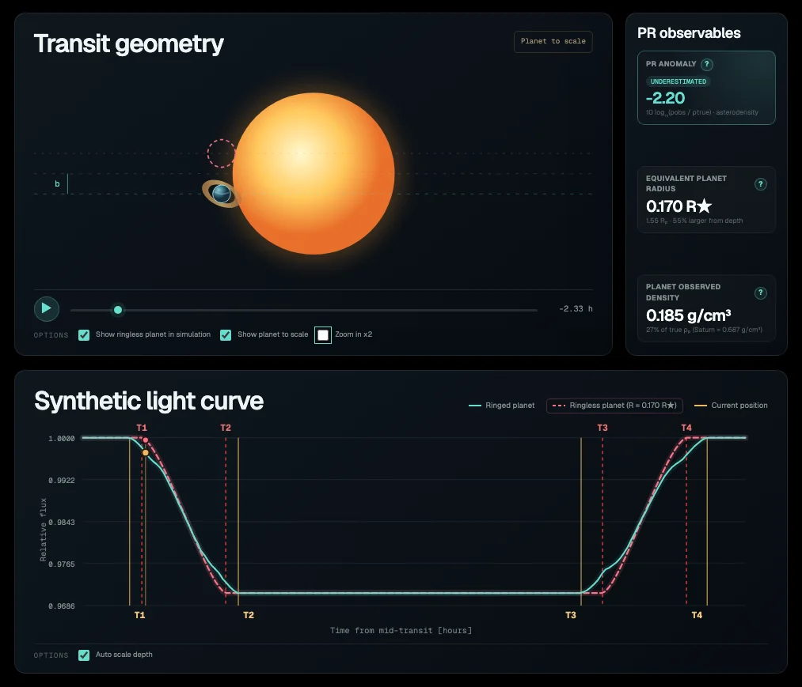

# PhotoRing Effect Simulator

By [Jorge I. Zuluaga](https://jorgezuluaga.github.io/index.html?lang=en)

This is the interactive page for rigorous PhotoRing (PR) modeling. It lets you vary a ringed planet's geometry and opacity, inspect the synthetic transit, and see how a ringless interpretation changes the inferred stellar properties.

The complete Bayesian inference pipeline is developed in the [PRisma repository](https://github.com/seap-udea/PRisma). This page is the interactive front end for exploring and visualizing the rigorous PhotoRing forward model.

## References

The PhotoRing effect was introduced in:

- [Zuluaga et al. (2015), *A Novel Method for Identifying Exoplanetary Rings*](https://doi.org/10.1088/2041-8205/803/1/L14), also available as [arXiv:1502.07818](https://arxiv.org/abs/1502.07818).

The model and its application to Kepler-51 were developed further in:

- [Zuluaga et al. (2026), *Probing Exoplanetary Rings with Asterodensity Profiling: A PhotoRing Analysis of Kepler-51*](https://arxiv.org/abs/2609.25234).

The equations below follow the PhotoRing geometry and asterodensity-profiling relations implemented in the `exorings` forward model used by PRisma.

## What Is The PhotoRing Effect?

A transit measures a planet's projected silhouette against the stellar disk. A ringed planet can block more light than its solid body alone and can enter or leave the stellar disk earlier. If the transit is analyzed as though the planet had no rings, the fitted radius and contact durations are biased.

Those biases propagate into the stellar properties inferred from the transit. The comparison between the inferred stellar density and the true stellar density is the PhotoRing anomaly:

$$
\mathrm{PR} = 10\log_{10}\left(\frac{\rho_{\star,\mathrm{obs}}}{\rho_{\star,\mathrm{true}}}\right).
$$

A negative PR means that the ringless interpretation underestimates the true stellar density. The simulator shows this effect while the parameters are changed interactively.

## Parameters And Defaults

The app opens with the following defaults:

| Symbol | Value | Meaning |
|---|---:|---|
| $p$ | $0.084\,R_\star$ | Planet-to-star radius ratio |
| $f_i$ | $1.58\,R_p$ | Inner ring radius in planet radii |
| $f_e$ | $2.35\,R_p$ | Outer ring radius in planet radii |
| $\theta_R$ | $25^\circ$ | Projected ring tilt |
| $i_R$ | $55^\circ$ | Ring inclination to the line of sight |
| $b$ | $0.25$ | True impact parameter |
| $\alpha$ | $\exp(-1)=0.367879$ | Fraction transmitted through the ring normal |
| $\tau$ | $1$ | Normal optical depth, with $\alpha=\exp(-\tau)$ |
| $P$ | $365.25$ days | Orbital period |
| $M_\star$ | $1\,M_\odot$ | Stellar mass |
| $R_\star$ | $1\,R_\odot$ | Stellar radius |

For the default star and period, $a\simeq0.999997\,\mathrm{AU}$ and $a/R_\star\simeq214.9$.

The app accepts shared configurations in the URL. Its copy button serializes the physical parameters and the active visualization options, so a copied link reproduces the same view.

## 1. Projected Ring Geometry

The planet has radius $p$ in stellar-radius units. The outer ring semimajor axis in the sky plane is:

$$
A=f_e p.
$$

For a ring inclination $i_R$, the projected semiminor axis is:

$$
B=A\cos i_R.
$$

The ring is rotated by the projected tilt $\theta_R$. For a direction $(n_x,n_y)$, the support radius of the projected ellipse is:

$$
h(n_x,n_y)=\sqrt{(A u)^2+(B v)^2},
$$

where

$$
u=n_x\cos\theta_R+n_y\sin\theta_R,
\qquad
v=-n_x\sin\theta_R+n_y\cos\theta_R.
$$

The same construction is evaluated at the left and right stellar limbs to obtain $h_L$ and $h_R$.

## 2. Contact Positions And Durations

For the solid planet alone, with true impact parameter $b$, the contacts in the orbital-track coordinate $x$ are:

$$
x_{1,4}^{(p)}=\mp\sqrt{(1+p)^2-b^2},
$$

$$
x_{2,3}^{(p)}=\mp\sqrt{(1-p)^2-b^2}.
$$

The outer ring contacts use the projected support radii:

$$
x_1^{(R)}=-\sqrt{(1+h_L)^2-b^2},
\qquad
x_2^{(R)}=-\sqrt{(1-h_L)^2-b^2},
$$

$$
x_3^{(R)}=+\sqrt{(1-h_R)^2-b^2},
\qquad
x_4^{(R)}=+\sqrt{(1+h_R)^2-b^2}.
$$

The final contacts are the outermost ingress and egress boundaries and the innermost full-transit boundaries:

$$
x_1=\min(x_1^{(p)},x_1^{(R)}),\quad
x_2=\max(x_2^{(p)},x_2^{(R)}),
$$

$$
x_3=\min(x_3^{(p)},x_3^{(R)}),\quad
x_4=\max(x_4^{(p)},x_4^{(R)}).
$$

The orbital inclination satisfies:

$$
\cos i_{\mathrm{orb}}=\frac{b}{a/R_\star},
\qquad
\sin i_{\mathrm{orb}}=\sqrt{1-\cos^2 i_{\mathrm{orb}}}.
$$

For any contact span $\Delta x$, the duration is:

$$
T(\Delta x)=\frac{P}{2\pi}
\arcsin\left(\frac{\Delta x}{(a/R_\star)\sin i_{\mathrm{orb}}}\right).
$$

Therefore:

$$
T_{14}=T(x_4-x_1),
\qquad
T_{23}=T(x_3-x_2).
$$

## 3. Ring Opacity And Transit Depth

The ring transmission along its normal is:

$$
\alpha=\exp(-\tau).
$$

After projection, the effective ring blocking factor used by the model is:

$$
\beta=1-\alpha^{1/\cos i_R}.
$$

The total transit depth is the effective blocked area divided by the stellar-disk area:

$$
\delta=\frac{A_{\mathrm{blocked}}}{A_\star}.
$$

The simulator estimates this area numerically over the occultor silhouette. The reference `exorings` model evaluates the corresponding analytical ring-area expressions.

## 4. Equivalent Ringless Planet

The equivalent ringless planet is defined as the planet that produces the same total transit depth. Since a ringless planet of radius $p_{\mathrm{obs}}$ blocks an area proportional to $p_{\mathrm{obs}}^2$:

$$
p_{\mathrm{obs}}=\sqrt{\delta}.
$$

For the app defaults, the reference model gives approximately:

| Quantity | Value |
|---|---:|
| $\delta$ | $0.0169169$ |
| $p_{\mathrm{obs}}$ | $0.130065\,R_\star$ |
| $T_{14}$ | $14.9956$ h |
| $T_{23}$ | $10.1131$ h |

The numerical area grid in the web app can differ from these analytical values by a small discretization error.

## 5. Asterodensity Profiling And Kipping Inversion

The ringed light curve is now interpreted as a ringless transit. Define:

$$
f_+=1+p_{\mathrm{obs}},
\qquad
f_-=1-p_{\mathrm{obs}},
$$

and

$$
q=\frac{\sin^2(\pi T_{23}/P)}{\sin^2(\pi T_{14}/P)}.
$$

The Kipping inversion used by the app gives the observed impact parameter:

$$
b_{\mathrm{obs}}^2=\frac{f_-^2-qf_+^2}{1-q}.
$$

The inferred scaled semimajor axis is:

$$
\frac{a_{\mathrm{obs}}}{R_\star}
=\frac{2P}{\pi}
\frac{p_{\mathrm{obs}}^{1/2}}{\sqrt{T_{14}^2-T_{23}^2}}.
$$

The inferred stellar density then follows from Kepler's third law:

$$
\rho_{\star,\mathrm{obs}}
=\frac{3\pi}{G P^2}
\left(\frac{a_{\mathrm{obs}}}{R_\star}\right)^3.
$$

When $P$ is expressed in seconds, this produces SI density; the app converts the result to $\mathrm{g\,cm^{-3}}$. For the app defaults, the reference model gives approximately:

| Quantity | Value |
|---|---:|
| $a/R_\star$ (true) | $214.9387$ |
| $a_{\mathrm{obs}}/R_\star$ | $181.7714$ |
| $b_{\mathrm{obs}}$ (Kipping) | $0.5681$ |
| $\rho_{\star,\mathrm{obs}}$ | $0.8516\,\mathrm{g\,cm^{-3}}$ |
| $\rho_{\star,\mathrm{obs}}/\rho_{\star,\mathrm{true}}$ | $0.6048$ |
| PR anomaly | $-2.18$ |

The value $b_{\mathrm{obs}}\simeq0.57$ is the Kipping convention used by the simulator. The alternate Mallen-Ornelas inversion gives approximately $0.8080$ for the same observables; it is not the convention used for the displayed app value. PR is reported as a dimensionless logarithmic quantity.

## Example: The Defaults Used By The App

The default setup uses a one-year orbit around a solar-mass, solar-radius star. The planet has $p=0.084$, an inner ring at $f_i=1.58$, an outer ring at $f_e=2.35$, tilt $25^\circ$, inclination $55^\circ$, impact parameter $b=0.25$, and $\tau=1$ so $\alpha=0.367879$.

The rings enlarge the projected occulting silhouette and increase the measured duration relative to the solid planet. The equivalent ringless radius becomes $0.1301\,R_\star$, larger than the physical planet radius. Interpreting that deeper and longer transit without rings yields $a_{\mathrm{obs}}/R_\star\simeq181.77$ instead of the true $214.94$, and therefore an underestimated stellar density. The resulting PR anomaly is about $-2.18$.

Change the ring inclination, tilt, radii, opacity, impact parameter, or period in the app and watch these derived quantities respond.

## Repository

- [PRisma](https://github.com/seap-udea/PRisma) — the complete PhotoRing inference and modeling pipeline.
- [PhotoRing simulator source](https://github.com/seap-udea/seap-udea.github.io/tree/main/apps/photoring-simulator) — this interactive page.

## Sharing Configurations Through The API

The simulator accepts its configuration through URL query parameters. This makes it possible to save, share, and reproduce a configuration without a database. Change the controls, press **Copy configuration**, and share the resulting URL.

The physical parameters are:

| Parameter | Meaning |
|---|---|
| `p` | Planet-to-star radius ratio |
| `fi`, `fe` | Inner and outer ring radii in planet radii |
| `tilt`, `ir` | Ring tilt and inclination in degrees |
| `b` | Impact parameter |
| `alpha` | Ring transmission, $\alpha=\exp(-\tau)$ |
| `mstar`, `rstar` | Stellar mass and radius in solar units |
| `aau` | Semimajor axis in AU |
| `porb` | Orbital period in days |

For the orbital quantities, the simulator accepts equivalent pairs such as `mstar+aau`, `mstar+porb`, `porb+aau`, or `porb+aRstar`. If redundant values are supplied, `mstar+aau` takes priority. When a configuration is copied, the link uses the canonical `mstar+rstar+aau` representation and omits redundant `porb` and `aRstar` values.

Visualization options are also shareable. Set them to `1` or `0`:

| Parameter | Meaning |
|---|---|
| `showRingless` | Show the equivalent ringless planet in Transit geometry |
| `planetToScale` | Draw the planet at its physical scale |
| `zoom2` | Zoom the Transit geometry preview by two |
| `autoDepth` | Scale the synthetic light curve to the current transit depth |
| `showEquivalent` | Show the equivalent ringless curve and contact markers |

### Saved Configurations

The links below open the simulator with reproducible configurations. The first configuration is the app default. The TOI-2449b link uses the system values and the Saturn-like reference ring defined in the TOI-2449b notebook; that notebook explores a range of ring orientations rather than reporting one unique fitted orientation, so this link uses a representative $\theta=25^\circ$, $i_R=55^\circ$ view. For Kepler-51, the values below are the medians printed in Figures 6 and 7 of the paper, not the separate grid-search results in Table 6.

1. **Default configuration** — $p=0.084$, $f_i=1.58$, $f_e=2.35$, $\theta=25^\circ$, $i_R=55^\circ$, $b=0.25$, $\alpha=\exp(-1)$, $M_\star=1\,M_\odot$, $R_\star=1\,R_\odot$, $a=0.999997\mathrm{AU}$.

	[Open the default configuration](https://seap-udea.github.io/apps/photoring-simulator/?p=0.084&fi=1.58&fe=2.35&tilt=25&ir=55&b=0.25&alpha=0.36787944117144233&mstar=1&rstar=1&aau=0.9999974887698985&showRingless=0&planetToScale=0&zoom2=0&autoDepth=0&showEquivalent=1)

2. **TOI-2449b reference configuration** — $P=106.14468$ days, $p=0.0967$, $b=0.704$, Saturn-like rings $f_i=1.526$, $f_e=2.269$, $\alpha=\exp(-1)$, $M_\star=1.079\,M_\odot$, $R_\star=1.065\,R_\odot$, $a=0.450\mathrm{AU}$.

	[Open the TOI-2449b reference configuration](https://seap-udea.github.io/apps/photoring-simulator/?p=0.0967&fi=1.526&fe=2.269&tilt=25&ir=55&b=0.704&alpha=0.36787944117144233&mstar=1.079&rstar=1.065&aau=0.450&showRingless=1&planetToScale=0&zoom2=0&autoDepth=0&showEquivalent=1)

3. **Kepler-51b Figure 6 median configuration** — $P=45.154$ days, $p=0.058$, $b=0.33$, $f_i=1$, $f_e=1.93$, $i_R=65.8^\circ$, $\theta=78.8^\circ$, $\alpha=0.33$, $\rho_{\star,\mathrm{true}}=2.11\,\mathrm{g\,cm^{-3}}$, $R_\star=0.869\,R_\odot$. The corresponding values used by the URL are $M_\star\simeq0.9834\,M_\odot$ and $a\simeq0.24678\mathrm{AU}$.

	[Open the Kepler-51b Figure 6 configuration](https://seap-udea.github.io/apps/photoring-simulator/?p=0.058&fi=1&fe=1.93&tilt=78.8&ir=65.8&b=0.33&alpha=0.33&mstar=0.9834202&rstar=0.869&aau=0.2467834&showRingless=1&planetToScale=0&zoom2=0&autoDepth=0&showEquivalent=1)

4. **Kepler-51d Figure 7 median configuration** — $P=130.186$ days, $p=0.081$, $b=0.28$, $f_i=1$, $f_e=1.73$, $i_R=70.87^\circ$, $\theta=67.39^\circ$, $\alpha=0.34$, $\rho_{\star,\mathrm{true}}=2.14\,\mathrm{g\,cm^{-3}}$, $R_\star=0.869\,R_\odot$. The corresponding values used by the URL are $M_\star\simeq0.9974\,M_\odot$ and $a\simeq0.50227\,\mathrm{AU}$.

	[Open the Kepler-51d Figure 7 configuration](https://seap-udea.github.io/apps/photoring-simulator/?p=0.081&fi=1&fe=1.73&tilt=67.39&ir=70.87&b=0.28&alpha=0.34&mstar=0.9974025&rstar=0.869&aau=0.5022714&showRingless=1&planetToScale=0&zoom2=0&autoDepth=0&showEquivalent=1)

## AI Assistance Disclosure

This site was developed entirely with AI tools (vibe-coded) under the guidance of a human, the author [Jorge I. Zuluaga](https://jorgezuluaga.github.io/index.html?lang=en). Although all of the web-page code was generated by AI models, the original code used to calculate the PhotoRing effect was extracted from the `exorings` package developed by the human author. The design of this simulator also arose from the author's original ideas. The scientific conception, model selection, interpretation of the results, and responsibility for the final implementation remain with the human author.

AI tools were used as coding, documentation, translation, and writing assistants. They have no intellectual authorship over the scientific content or the original ideas behind the simulator.

## License

MIT — see the repository license. By [Jorge I. Zuluaga](https://jorgezuluaga.github.io/index.html?lang=en) (C) 2026-present
